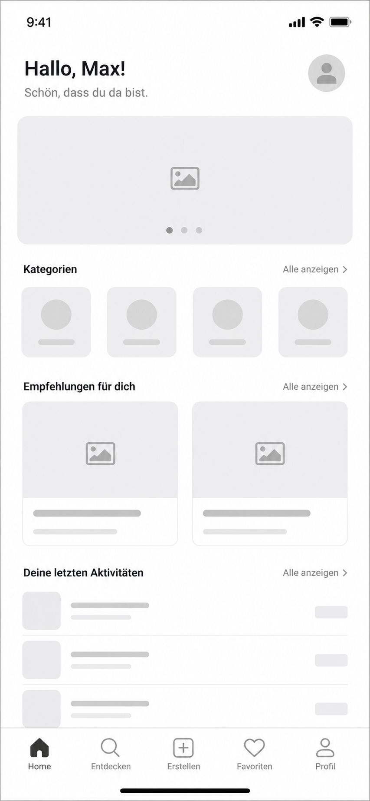
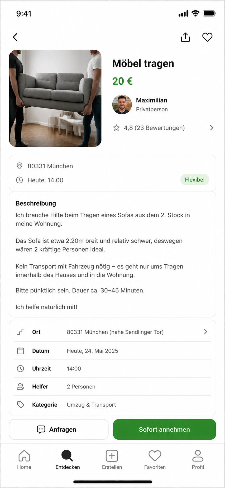
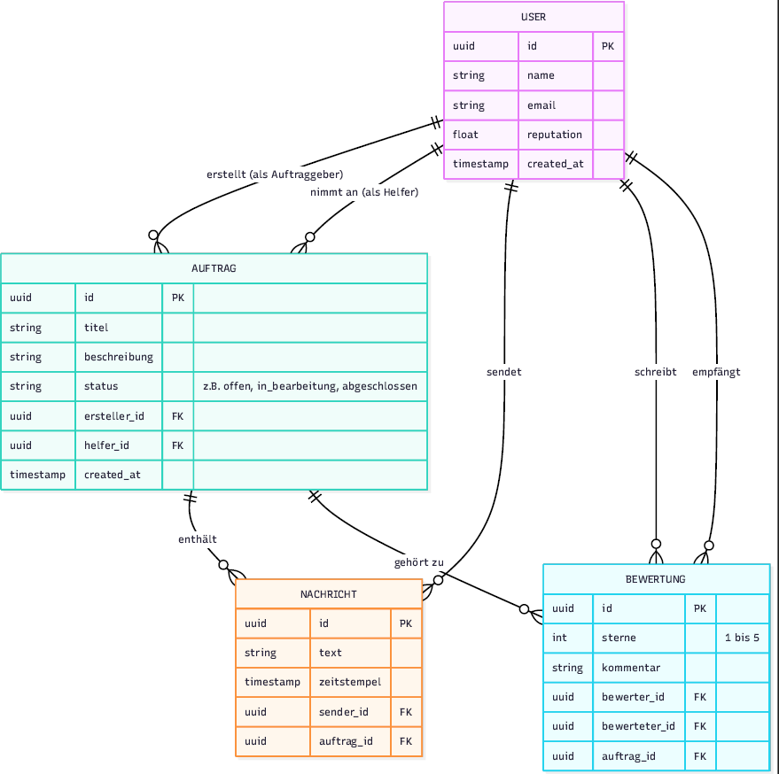
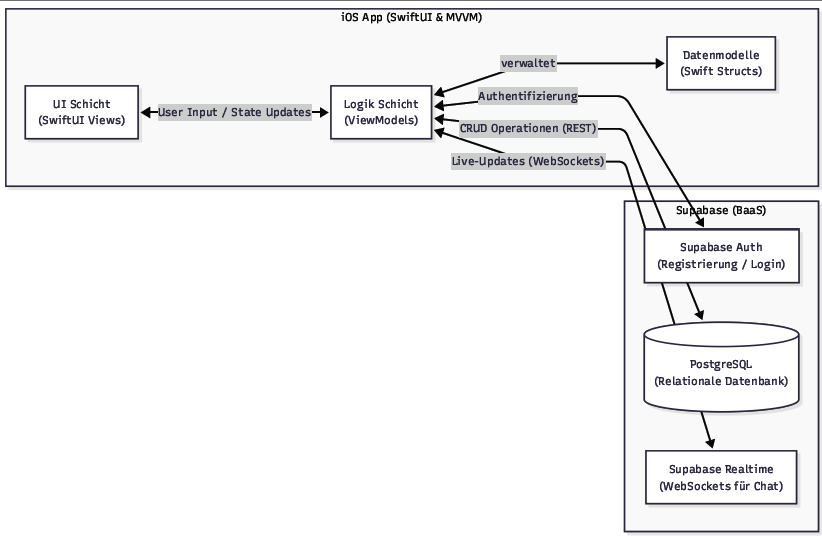

# Gruppe

Simon Pham, Matr.Nr 3646757
Mike Jenke, Matr.Nr 3649732

# Git

Der Quellcode des Projekts wird auf GitHub gehostet und ist unter den folgenden Links erreichbar:

- **HTTPS:** `https://github.com/simondeveloping/IOS_APP.git`
- **SSH:** `git@github.com:simondeveloping/IOS_APP.git`

# Idee

Die geplante iOS-Applikation überträgt das Konzept der Nachbarschaftshilfe in eine digitale Plattform. Im Gegensatz zu lokalen Gruppen, die sich oft nur auf den unmittelbaren Wohnort beschränken, erweitert diese App den Radius und vernetzt Nutzer auch über die direkte Nachbarschaft hinaus. Ziel ist es, eine unkomplizierte und vertrauenswürdige Plattform für alltägliche Dienstleistungen und Gefälligkeiten zu schaffen.

### Kernfunktionen & Ablauf

#### 1. Rollenverteilung

Nutzer können auf der Plattform primär zwei Rollen einnehmen:

- **Auftraggeber (Hilfesuchende):** Nutzer können kleine Jobs oder Alltagsaufgaben als Inserat hochladen (z. B. „Hilfe beim Glühbirne wechseln“, „Einkauf erledigen“, „Möbelstück tragen“).
- **Auftragnehmer (Helfer):** Andere Nutzer können diese Inserate in einem festgelegten Radius einsehen und den Job annehmen.

#### 2. Matchmaking & Auftragsannahme

Sobald ein Auftraggeber einen Job veröffentlicht hat, können interessierte Helfer diesen anfragen. Der Auftraggeber entscheidet am Ende, wem er die Aufgabe anvertraut.

#### 3. Validierung per QR-Code

Um Sicherheit für beide Seiten zu gewährleisten, nutzen wir einen systemseitigen Abschluss-Prozess: Sobald die Aufgabe vor Ort erledigt wurde, generiert die App einen individuellen QR-Code. Dieser muss vom Helfer mit dem Smartphone gescannt werden. Erst durch diesen Scan wird der Job im System als „erfolgreich abgeschlossen“ markiert.

#### 4. Bewertungs- und Reputationssystem

Nach der erfolgreichen Validierung schaltet die App die Bewertungsfunktion frei. Beide Parteien können sich gegenseitig bewerten (z.B. über ein Sterne-System). Das baut Vertrauen innerhalb der Community auf und hilft zukünftigen Nutzern bei der Auswahl.

# Anwendungsfälle und Anforderungen

Aus den geplanten Kernfunktionen leiten sich folgende Anwendungsfälle ab:

- Registrierung und Anmeldung von Nutzern.
- Ein Auftraggeber erstellt einen Auftrag.
- Ein Helfer sucht nach Aufträgen in seiner Umgebung.
- Ein Helfer schickt eine Anfrage für den Auftrag oder nimmt diesen an.
- Kommunikation (Chat) zwischen Auftraggeber und Helfer.
- Bestätigung eines Auftrages per QR-Code.
- Abgabe einer Bewertung nach Abschluss.
- Einsehen der Reputation eines Benutzers.

## Funktionale Anforderungen

- **Authentifizierung:** Benutzerregistrierung und Anmeldung via Email/Passwort.
- **Profilverwaltung:** Erstellen und Anpassen des eigenen Nutzerprofils.
- **CRUD-Operationen für Aufträge:** Erstellen, Bearbeiten, Löschen und Anzeigen von Inseraten.
- **Filter- und Suchfunktion:** Aufträge nach Kategorien oder Distanz sortieren.
- **Benachrichtigungen:** Push-Benachrichtigungen bei neuen Anfragen oder Nachrichten.
- **Chat:** Echtzeit-Kommunikation zwischen den involvierten Nutzern.
- **QR-Scanner:** Kamerazugriff zum Scannen und Generieren von Codes.
- **Bewertungssystem:** Speichern und Berechnen von Reputationswerten.
- **Moderation:** Möglichkeit, Nutzer oder Inserate zu melden.

## Nicht-Funktionale Anforderungen

- **Sicherheit:** Passwörter werden gehasht gespeichert; sichere Authentifizierung über das Backend.
- **Performance:** App-Ansichten und Listen laden ohne spürbare Verzögerung.
- **Benutzerfreundlichkeit:** Intuitive Bedienung unter Einhaltung der Apple Human Interface Guidelines.
- **Wartbarkeit:** Modularer Aufbau des Swift-Codes (MVVM-Pattern).
- **Kompatibilität:** Lauffähig auf aktuellen iOS-Versionen.
- **Datenintegrität:** Konsistente Speicherung der Relationen zwischen Nutzern, Aufträgen und Chats.

# Konzept und geplanter Aufbau

Die App wird als native iOS-Anwendung in Swift entwickelt. Die Architektur orientiert sich am MVVM-Pattern (Model-View-ViewModel).

**Backend-Strategie:**
Da es sich um ein Studienprojekt mit Fokus auf die iOS-Entwicklung handelt, wird kein eigenes Backend (wie z.B. Spring Boot) von Grund auf implementiert. Stattdessen nutzen wir **Supabase** als Backend-as-a-Service (BaaS). Supabase stellt eine PostgreSQL-Datenbank bereit und bietet ein Swift-SDK, mit dem direkt aus der App sicher auf die Daten zugegriffen werden kann.

Supabase übernimmt dabei folgende Aufgaben:

- Relationale Datenbank (Speicherung von Profilen, Aufträgen, Bewertungen).
- Benutzer-Authentifizierung (Supabase Auth).
- Echtzeit-Updates für den Chat (Realtime Subscriptions).

# Arbeitspakete und Aufteilung

Beide Projektmitglieder arbeiten primär an der iOS-App in Swift, wobei die Aufgaben grob in Frontend/UI und Backend-Anbindung/Logik unterteilt werden können.

- **Setup:** Einrichtung des Xcode-Projekts, Git-Repository und des Supabase-Projekts (Tabellen, RLS-Policies). Simon
- **Datenmodellierung:** Definition der Swift-Structs passend zum PostgreSQL-Schema in Supabase. Simon
- **Authentifizierung:**
  Implementierung der UI. Mike
  Logik für Login/Registrierung über Supabase. Simon
- **Auftragsverwaltung:** Erstellen der Views zum Anlegen und Verwalten von Hilfsaufträgen. Mike
- **Feed:** Entwicklung der Listenansicht (Map- oder List-View) für verfügbare Aufträge. Mike
- **Chat:** Implementierung der Nachrichten-Ansicht mittels Supabase Realtime. Simon
- **Kamera/QR-Feature:** Integration von AVFoundation zum Generieren und Scannen der Codes. Mike
- **Bewertungssystem:**
  UI. Simon
  Logik zur Reputationsberechnung. Mike
- **Testing & Bugfixing:** Testläufe auf Simulatoren und physischen Endgeräten. Simon / Mike

# Milestones

Die Arbeitspakete sind anhand der wöchentlichen Termine des Kurses wie folgt aufgeteilt:

- **29.05.26 - Setup & Login**

  - Projekt-Setup (Xcode & GitHub) und Einrichtung von Supabase (Datenbank-Schema).
  - Erstellung der SwiftUI-Views für Registrierung und Login inkl. Datenbankanbindung.

- **05.06.26 - Aufträge & Feed**

  - Definition der Datenmodelle in Swift.
  - Implementierung der Funktionen zum Erstellen, Bearbeiten und Löschen von Aufträgen.
  - Bauen der Feed-Ansicht, damit Nutzer verfügbare Jobs in der Liste sehen können.

- **12.06.26 - Matchmaking & Profile**

  - Detailansichten für die einzelnen Aufträge bauen.
  - Logik implementieren: Helfer können Aufträge anfragen, Auftraggeber können zuweisen.
  - Profilansicht zum Anzeigen der eigenen Nutzerdaten fertigstellen.

- **19.06.26 - Chat-Funktion**

  - Bauen der Chat-UI in SwiftUI.
  - Anbindung an Supabase Realtime, damit Helfer und Auftraggeber direkt miteinander schreiben können.

- **26.06.26 - QR-Scanner**

  - Kamerazugriff einbauen (AVFoundation).
  - Logik zum Generieren der QR-Codes für aktive Aufträge.
  - Scanner-Funktion zum beidseitigen Validieren und Abschließen der Jobs.

- **03.07.26 - Bewertungssystem & Bugfixing**

  - Bewertungsfunktion einbauen (wird nach Auftragsabschluss freigeschaltet).
  - App ausführlich im Simulator und auf echten Geräten testen.
  - Fehler beheben (Bugfixing) und UI-Feinschliff (z. B. Error-Handling ohne Internet).

- **10.07.26 - Abgabe Projekt, Präsentation**
  - Vorbereitung der Folien und der Live-Demo für die Präsentation.

# Ausblick

Nach der erfolgreichen Implementierung der Kernfunktionen (MVP) im Rahmen des Kurses bieten sich für die Zukunft verschiedene realistische Erweiterungsmöglichkeiten an:

- **Kartenintegration:** Einbindung von Apple MapKit, um Aufträge nicht nur in einer Liste, sondern auch visuell auf einer interaktiven Karte darzustellen. Dies erleichtert Helfern die Einschätzung der Wegstrecke.
- **Optimierte Barrierefreiheit (Accessibility):** Da die Zielgruppe für Hilfsangebote häufig auch ältere oder körperlich eingeschränkte Personen umfasst, kann die App tiefergehend auf VoiceOver-Unterstützung und dynamische Schriftgrößen (Dynamic Type) optimiert werden.
- **Auslagen-Management:** Eine Funktion im Chat oder beim Auftragsabschluss, um Kassenbons (z.B. für erledigte Einkäufe) als Foto hochzuladen und Materialkosten transparent zwischen den Parteien zu dokumentieren, ohne direkt einen Bezahldienst integrieren zu müssen.
- **Erweitertes Vertrauenssystem:** Einführung von Profil-Badges (z.B. "Verifizierte Telefonnummer" oder Meilensteine wie "10 erfolgreiche Hilfen"), um die Sicherheit und das Vertrauen innerhalb der Community weiter zu stärken.

# Anhang

Die Skizzen stehen noch nicht zu 100% fest. Die müssten im Verlaufe eventuell noch geändert werden.

Skizzen:

Layout:

Auftrag:

ER Diagramm
[ER Diagramm](ER_Diagramm_Entwurf.pdf)

Schnittstellen_Entwurf
[Schnittstellen](Schnitstellen_Entwurf.pdf)

